  

  
  

---

### 👋 About me

- 🎓 **BSIT student** who likes turning class projects into things people actually use
- 🔨 **Building now:** a library resource management system for our campus, with PHP, Firebase and a Gemini-powered assistant
- 📱 **Shipped:** an Android POS app that helps student entrepreneurs at school track their sales
- 🌱 **Leveling up:** ASP.NET Core, clean REST APIs and UI design
- ⚡ **Fun fact:** yes, that many a's in my username is on purpose

### 🧰 Tech I work with

  

### 🚀 Featured projects

<table>
<tr>
<td width="50%" valign="top">

**[💊 PulseCare](https://github.com/Caaaaaaaaaarl/PulseCare)** 
Healthcare management web app where patients and doctors manage appointments, consultations and reminders. A team project. 
`ASP.NET Core MVC` `EF Core` `SQL Server`

</td>
<td width="50%" valign="top">

**[🧾 POS](https://github.com/Caaaaaaaaaarl/POS)** 
Android point-of-sale app built to help student entrepreneurs at school handle their sales. 
`Kotlin` `Android`

</td>
</tr>
<tr>
<td width="50%" valign="top">

**[📦 InventoryManagementSystem](https://github.com/Caaaaaaaaaarl/InventoryManagementSystem)** 
CLI-based inventory management system, my Internet Technologies midterm project. 
`C#` `.NET`

</td>
<td width="50%" valign="top">

**[⚡ Bolo_3A_Minimal_API](https://github.com/Caaaaaaaaaarl/Bolo_3A_Minimal_API)** 
A lightweight REST API built with ASP.NET Core minimal APIs. 
`C#` `ASP.NET Core`

</td>
</tr>
</table>

### 📊 GitHub at a glance

  

  <picture>
    <source media="(prefers-color-scheme: dark)" srcset="https://raw.githubusercontent.com/Caaaaaaaaaarl/Caaaaaaaaaarl/output/github-contribution-grid-snake-dark.svg">
    <source media="(prefers-color-scheme: light)" srcset="https://raw.githubusercontent.com/Caaaaaaaaaarl/Caaaaaaaaaarl/output/github-contribution-grid-snake.svg">
    
  </picture>

### 💬 Random dev quote

  

The stats card and contribution snake are redrawn daily by <a href="./.github/workflows/profile-assets.yml">a GitHub Action</a> in this repo.

